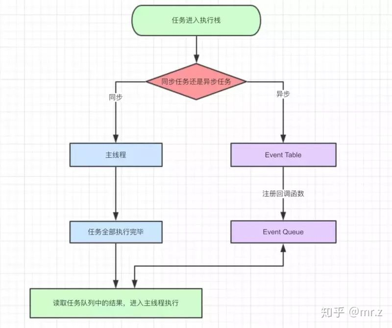

# js 中的 EventLoop

## 起始
### EventLoop 是什么
> JavaScript有一个基于事件循环(EventLoop)的并发模型，事件循环负责执行代码、收集和处理事件以及执行队列中的子任务。  
> 浏览器和NodeJS基于不同的技术实现了各自的Event Loop。

### 事件循环
之所以称之为 事件循环，是因为它经常按照类似如下的方式来被实现：
```js
while (queue.waitForMessage()) {
  queue.processNextMessage();
}
```
queue.waitForMessage() 会同步地等待消息到达(如果当前没有任何消息等待被处理)。

## 事件
### 同步任务和异步任务
Javascript单线程任务被分为同步任务和异步任务，同步任务会在调用栈中按照顺序等待主线程依次执行，异步任务会在异步任务有了结果后，将注册的回调函数放入任务队列中等待主线程空闲的时候（调用栈被清空），被读取到栈内等待主线程的执行。


从图中可以看出, js 的指向都是会先指向同步代码,碰到异步代码都是存入队列中, 等同步代码执行完毕之后再按照一定的规则执行

### 异步任务的分类
#### 宏任务
macrotask，也叫tasks。 一些异步任务的回调会依次进入macro task queue，等待后续被调用，这些异步任务包括
- setTimeout
- setInterval
- setImmediate (Node独有)
- requestAnimationFrame (浏览器独有)
- I/O
- UI rendering (浏览器独有)
#### 微任务
microtask，也叫jobs。 另一些异步任务的回调会依次进入micro task queue，等待后续被调用，这些异步任务包括：

- process.nextTick (Node独有)
- Promise
- Object.observe
- MutationObserver

这里只针对浏览器和NodeJS

## 运行

运行原理:
1. 运行同步任务, 微任务加入队列, 等待同步任务执行完毕
2. 查看是否有微任务, 若有则执行, 按照先进先出的规则进行
3. 微任务结束后执行宏任务, 执行完每一个宏任务之后都会再次进入第 2 步流程
4. 微任务和宏任务都执行完毕

### 例子1:
```
console.log('script start');

setTimeout(function() {
  console.log('setTimeout');
}, 0);

Promise.resolve().then(function() {
  console.log('promise1');
}).then(function() {
  console.log('promise2');
});
console.log('script end');
```
执行结果:
```
script start
script end
promise1
promise2
setTimeout
```
分析一下执行的过程:
1. 执行了同步代码 `console.log('script start');` 和 `console.log('script end');`
2. 执行微任务 `Promise` ,打印 `promise`
3. 执行宏任务 `setTimeout`
4. 清空队列和栈堆


参考引用:
https://segmentfault.com/a/1190000016278115
https://developer.mozilla.org/zh-CN/docs/Web/JavaScript/EventLoop
https://zhuanlan.zhihu.com/p/55511602
