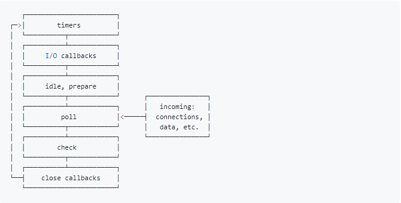

# js 中的 EventLoop

## 起始
### EventLoop 是什么
> JavaScript有一个基于事件循环(EventLoop)的并发模型，事件循环负责执行代码、收集和处理事件以及执行队列中的子任务。  
> 浏览器和NodeJS基于不同的技术实现了各自的Event Loop。

### 事件循环
之所以称之为 事件循环，是因为它经常按照类似如下的方式来被实现：
```js
while (queue.waitForMessage()) {
  queue.processNextMessage();
}
```
queue.waitForMessage() 会同步地等待消息到达(如果当前没有任何消息等待被处理)。

## 事件
### 同步任务和异步任务
Javascript单线程任务被分为同步任务和异步任务，同步任务会在调用栈中按照顺序等待主线程依次执行，异步任务会在异步任务有了结果后，将注册的回调函数放入任务队列中等待主线程空闲的时候（调用栈被清空），被读取到栈内等待主线程的执行。


从图中可以看出, js 的指向都是会先指向同步代码,碰到异步代码都是存入队列中, 等同步代码执行完毕之后再按照一定的规则执行

### 异步任务的分类
#### 宏任务
macrotask，也叫tasks。 一些异步任务的回调会依次进入macro task queue，等待后续被调用，这些异步任务包括
- setTimeout
- setInterval
- setImmediate (Node独有)
- requestAnimationFrame (浏览器独有)
- I/O
- UI rendering (浏览器独有)
#### 微任务
microtask，也叫jobs。 另一些异步任务的回调会依次进入micro task queue，等待后续被调用，这些异步任务包括：

- process.nextTick (Node独有)
- Promise
- Object.observe
- MutationObserver

这里只针对浏览器和NodeJS

## 运行

运行原理:
1. 运行同步任务, 微任务加入队列, 等待同步任务执行完毕
2. 查看是否有微任务, 若有则执行, 按照先进先出的规则进行
3. 微任务结束后执行宏任务, 执行完**每一个**宏任务之后都会再次进入第 2 步流程
4. 微任务和宏任务都执行完毕

### 例子1:
```
console.log('script start');

setTimeout(function() {
  console.log('setTimeout');
}, 0);

Promise.resolve().then(function() {
  console.log('promise1');
}).then(function() {
  console.log('promise2');
});
console.log('script end');
```
执行结果:
```
script start
script end
promise1
promise2
setTimeout
```
分析一下执行的过程:
1. 执行了同步代码 `console.log('script start');` 和 `console.log('script end');`
2. 执行微任务 `Promise` ,打印 `promise`
3. 执行宏任务 `setTimeout`
4. 清空队列和栈堆


### 例子 2:
```
console.log(1);

setTimeout(() => {
  console.log(2);
  Promise.resolve().then(() => {
    console.log(3)
  });
});

new Promise((resolve, reject) => {
  console.log(4)
  resolve(5)
}).then((data) => {
  console.log(data);
})

setTimeout(() => {
  console.log(6);
})

console.log(7);
```
结果:
```
1
4
7
5
2
3
6
```
执行过程:
1. 首先自然是执行同步代码: 几个 console, 关于 `new Promise` 需要注意的是, 他 `new`
   的时候, 并不是异步的,回调函数才是异步任务, 所以打印的是: 1,4,7
2. 执行微任务, promise 里的几个 then 回调函数, 所以打印 5
3. 微任务暂时执行完毕, 执行宏任务, setTimeout, 打印 2, 这个时候又出现了一个微任务加入了微任务的队列
4. 一个宏任务执行完毕了, 发现了新的同步任务和微任务,开始执行, 打印 3, 微任务执行完毕
5. 执行下一个宏任务, 打印 6
6. 全部执行完毕, 打印顺序是: 1,4,7,5,2,3,6

**在执行微队列microtask queue中任务的时候，如果又产生了microtask，那么会继续添加到队列的末尾，也会在这个周期执行，直到microtask queue为空停止。**   
当然如果你在microtask中不断的产生microtask，那么其他宏任务macrotask就无法执行了，但是这个操作也不是无限的，拿NodeJS中的微任务process.nextTick()来说，它的上限是1000个;

# node 中的 EventLoop
> --- 引用自其它博客

`Node`中的`Event Loop`是基于`libuv`实现的，而`libuv`是 `Node` 的新跨平台抽象层，libuv使用异步，事件驱动的编程方式，核心是提供`i/o`的事件循环和异步回调。libuv的`API`包含有时间，非阻塞的网络，异步文件操作，子进程等等。 `Event Loop`就是在`libuv`中实现的。  


### node 中的宏队列
宏队列的回调任务有如下 6 个阶段


各个阶段执行的任务如下：

*   **timers阶段**：这个阶段执行setTimeout和setInterval预定的callback
*   **I/O callback阶段**：执行除了close事件的callbacks、被timers设定的callbacks、setImmediate()设定的callbacks这些之外的callbacks
*   **idle, prepare阶段**：仅node内部使用
*   **poll阶段：获取新的I/O事件**，适当的条件下node将阻塞在这里
*   **check阶段**：执行setImmediate()设定的callbacks
*   **close callbacks阶段**：执行socket.on('close', ....)这些callbacks

NodeJS中宏队列主要有4个

由上面的介绍可以看到，回调事件主要位于4个macrotask queue中：

1. Timers Queue
2. IO Callbacks Queue
3. Check Queue
4. Close Callbacks Queue

这4个都属于宏队列，但是在浏览器中，可以认为只有一个宏队列，所有的macrotask都会被加到这一个宏队列中，但是在NodeJS中，不同的macrotask会被放置在不同的宏队列中。

**NodeJS中微队列主要有2个**：

1.  Next Tick Queue：是放置process.nextTick(callback)的回调任务的
2.  Other Micro Queue：放置其他microtask，比如Promise等

大体解释一下NodeJS的Event Loop过程：

1.  执行全局Script的同步代码
2.  执行microtask微任务，先执行所有Next Tick Queue中的所有任务，再执行Other Microtask Queue中的所有任务
3.  开始执行macrotask宏任务，共6个阶段，从第1个阶段开始执行相应每一个阶段macrotask中的所有任务，注意，这里是所有每个阶段宏任务队列的所有任务，在浏览器的Event Loop中是只取宏队列的第一个任务出来执行，每一个阶段的macrotask任务执行完毕后，开始执行微任务，也就是步骤2
4.  Timers Queue \-> 步骤2 \-> I/O Queue \-> 步骤2 \-> Check Queue \-> 步骤2 \-> Close Callback Queue \-> 步骤2 \-> Timers Queue ......
5.  这就是Node的Event Loop


总体来说运行机制是和浏览器里面差不多的 也是先同步代码, 再一步微任务,宏任务,微任务...这样
唯一不同点就是宏任务是一系列动作,在第一个动作完毕后就会去检查微任务


参考引用:
https://segmentfault.com/a/1190000016278115
https://developer.mozilla.org/zh-CN/docs/Web/JavaScript/EventLoop
https://zhuanlan.zhihu.com/p/55511602
