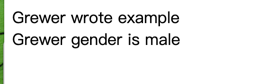
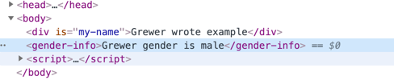
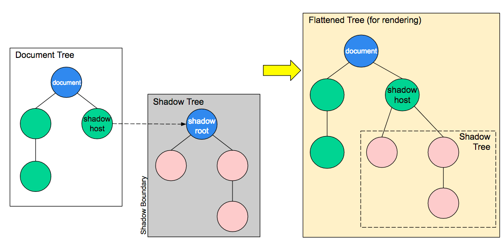
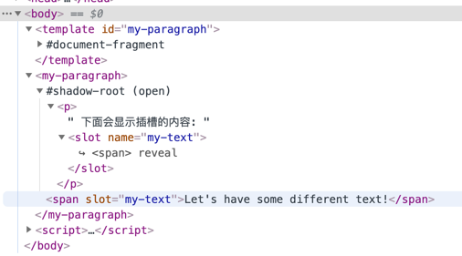
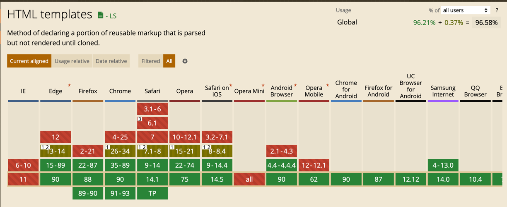
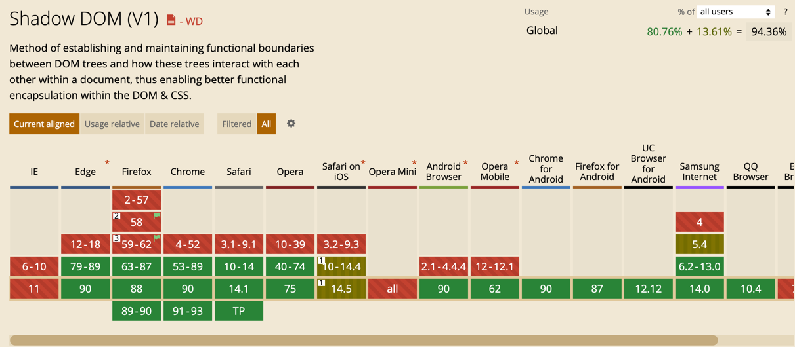
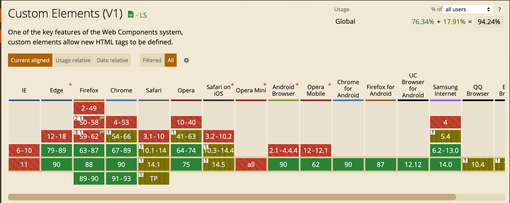
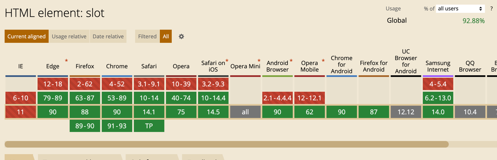

# WebComponents

## 起因
说起来这个东西, 出来了至少 2 年了, 但是因为最近两年我基本没做过 web 端的东西, 所以也没怎么了解过了, 趁着这次放假, 补充一下知识点


先来看看 MDN 中对于他的描述:

Web Components旨在解决这些问题 — 它由三项主要技术组成，它们可以一起使用来创建封装功能的定制元素，可以在你喜欢的任何地方重用，不必担心代码冲突。

*   **Custom elements（自定义元素）：**一组JavaScript API，允许您定义custom elements及其行为，然后可以在您的用户界面中按照需要使用它们。
*   **Shadow DOM（影子DOM）**：一组JavaScript API，用于将封装的“影子”DOM树附加到元素（与主文档DOM分开呈现）并控制其关联的功能。通过这种方式，您可以保持元素的功能私有，这样它们就可以被脚本化和样式化，而不用担心与文档的其他部分发生冲突。
*   **HTML templates（HTML模板）：** [`<template>`](https://developer.mozilla.org/zh-CN/docs/Web/HTML/Element/template) 和 [`<slot>`](https://developer.mozilla.org/zh-CN/docs/Web/HTML/Element/slot) 元素使您可以编写不在呈现页面中显示的标记模板。然后它们可以作为自定义元素结构的基础被多次重用。


## Custom elements（自定义元素）

> Web Components 标准非常重要的一个特性是，它使开发者能够将HTML页面的功能封装为 custom elements（自定义标签），而往常，开发者不得不写一大堆冗长、深层嵌套的标签来实现同样的页面功能。

### CustomElementRegistry
> 用来处理 web 文档中的 custom elements — 该对象允许你注册一个 custom element，返回已注册 custom elements 的信息，等等。

共有两种 custom elements：

*   **Autonomous custom elements** 是独立的元素，它不继承其他内建的HTML元素。你可以直接把它们写成HTML标签的形式，来在页面上使用。例如 `<popup-info>`，或者是`document.createElement("popup-info")`这样。
*   **Customized built\-in elements** 继承自基本的HTML元素。在创建时，你必须指定所需扩展的元素（正如上面例子所示），使用时，需要先写出基本的元素标签，并通过 [`is`](https://developer.mozilla.org/zh-CN/docs/Web/HTML/Global_attributes#attr-is) 属性指定custom element的名称。例如`<p is="word-count">`, 或者 `document.createElement("p", { is: "word-count" })`。


#### customElements.define

用来注册一个 custom element，该方法接受以下参数

*   表示所创建的元素名称的符合 [`DOMString`](https://developer.mozilla.org/zh-CN/docs/Web/API/DOMString) 标准的字符串。注意，custom element 的名称不能是单个单词，且其中 [必须要有短横线](https://html.spec.whatwg.org/#valid-custom-element-name) 。
*   用于定义元素行为的 [类](https://developer.mozilla.org/en-US/docs/Web/JavaScript/Reference/Classes) 。
*   `可选参数`，一个包含 `extends` 属性的配置对象，是可选参数。它指定了所创建的元素继承自哪个内置元素，可以继承任何内置元素。

#### 小栗子:

```html
<div is="my-name"></div>
<gender-info></gender-info>
<script>
    // 基础 HTML 的元素
    class Names extends HTMLDivElement {
        constructor() {
            super();
            // this 指向的就是当前元素
            this.innerText = 'Grewer wrote example'
        }
    }

    customElements.define('my-name', Names, {extends: 'div'});


    // 自定义标签:
    class Gender extends HTMLElement {
        constructor() {
            // 必须首先调用 super方法
            super();

            this.innerText = 'Grewer gender is male'

            // 添加方法
            this.onclick = () => {
                console.log('run in customElement')
            }
        }
    }

    customElements.define('gender-info', Gender)
</script>
```
页面的显示:


DOM 中的显示:




#### 组件名注意点
- 必须有 "-"  如果组件名是 gender  则直接报错, 即使是这样的名称也可以 "gender-"
- 首字母也不能大写, 比如就不能写成 Gender-info

### 生命周期

在custom element的构造函数中，可以指定多个不同的回调函数，它们将会在元素的不同生命时期被调用：

*   `connectedCallback`：当 custom element首次被插入文档DOM时，被调用。
*   `disconnectedCallback`：当 custom element从文档DOM中删除时，被调用。
*   `adoptedCallback`：当 custom element被移动到新的文档时，被调用。
*   `attributeChangedCallback`: 当 custom element增加、删除、修改自身属性时，被调用。


大部分生命周期和其他框架的类似, 但是其中有一个 `attributeChangedCallback` 需要说明下:

```html

<life-test></life-test>

<script>

    class Life extends HTMLElement {
        // 用来搭配 attributeChangedCallback, 控制要监听的具体属性
        static get observedAttributes() {
            return ['style', 'test'];
        }

        constructor() {
            super();
            this.innerText = 'life test  click'
            this.onclick = this.change
        }

        change = () => {
            console.log('add run')
            this.style.background = `rgba(0, 0, 0, ${Math.random()})`
            this.setAttribute('test', Math.random() * 100)
        }
        
        attributeChangedCallback(...arg) {
            // 打印的值分别是: 属性值名, 旧值, 新值  如果没有就为 null
            // 如果同时改变了 2 个属性, 则触发此函数两次
            console.log('changed', arg)
        }
    }

    customElements.define('life-test', Life)
    
</script>
```
想要使用 `attributeChangedCallback` 生命周期, 就必须搭配上 `observedAttributes`
在线查看上述 dom: [点击查看](https://grewer.github.io/JsDemo/webComponents/CustomElements.html)


## shadow DOM

Web components 的一个重要属性是封装——可以将标记结构、样式和行为隐藏起来，并与页面上的其他代码相隔离，保证不同的部分不会混在一起，可使代码更加干净、整洁。其中，Shadow DOM 接口是关键所在，它可以将一个隐藏的、独立的 DOM 附加到一个元素上。

有了组件的定义之后, 当然少不了 scoped 的掌控, 而 shadow DOM 就是用来做这个的

Shadow DOM 允许将隐藏的 DOM 树附加到常规的 DOM 树中——它以 shadow root 节点为起始根节点，在这个根节点的下方，可以是任意元素，和普通的 DOM 元素一样。


这里，有一些 Shadow DOM 特有的术语需要我们了解：

*   Shadow host：一个常规 DOM节点，Shadow DOM 会被附加到这个节点上。
*   Shadow tree：Shadow DOM内部的DOM树。
*   Shadow boundary：Shadow DOM结束的地方，也是常规 DOM开始的地方。
*   Shadow root: Shadow tree的根节点。


### 基本使用:

```html
<div id="foo"></div>
<body>
<script>
    const div = document.getElementById('foo')
    // 将普通 dom 转换为 shadow dom
    let shadow = div.attachShadow({mode: 'open'});


    // 获取 shadow dom 对象
    // 如果 mode: 'open' 则能够正常获取, 如果为 closed  则 shadowObj 是 null
    const shadowObj = div.shadowRoot
    console.log(shadowObj)


    const p = document.createElement('p')
    p.textContent = 'this is p'
    // 关于 textContent 和 innerText 的区别: https://developer.mozilla.org/zh-CN/docs/Web/API/Node/textContent#%E4%B8%8E_innertext_%E7%9A%84%E5%8C%BA%E5%88%AB

    shadow.append(p)
</script>
```
我感觉不足的地方在于, 只有在 dom 创建完毕之后在可以将他转变成 shadow dom, 而不是在浏览器的创建阶段


### 添加 styles

```html
<style>
    p{
        background-color: #444444;
    }
</style>
<div id="foo"></div>
<p>不在 shadow 中的 p</p>
<body>
<script>
    //省略前一步的代码

    const style = document.createElement('style');

    style.textContent =  `
        p {
            background-color: #2c9edd;
        }
    `
    shadow.append(style)

    // 通过运行可以看到 p 的样式有了一个 scoped
</script>
```
在线查看: [点击查看](https://grewer.github.io/JsDemo/webComponents/ShadowDom.html)

当然我们也可以使用外部样式:

```js
// 将外部引用的样式添加到 Shadow DOM 上
const linkElem = document.createElement('link');
linkElem.setAttribute('rel', 'stylesheet');
linkElem.setAttribute('href', 'style.css');

// 将所创建的元素添加到 Shadow DOM 上
shadow.appendChild(linkElem);
```

### Shadow Dom 和 Custom Element 搭配使用

```html
<life-test></life-test>
<script>
  class Life extends HTMLElement {

    constructor() {
      super();
      const shadow = this.attachShadow({mode: 'closed'});
        
      const p = document.createElement('p')
      p.textContent = 'click me'
      shadow.append(p)
      this.p = p

      this.onclick = this.change
    }

    change = () => {
      console.log('add run')
      this.p.style.background = `rgba(0, 0, 0, ${Math.random()})`
      this.p.setAttribute('test', Math.random() * 100)
    }

    connectedCallback() {
      console.log('connectedCallback', '初始化')
    }

  }

  customElements.define('life-test', Life)
</script>
```
在线查看: [点击查看](https://grewer.github.io/JsDemo/webComponents/ShadowDom2.html)

## templates and slots

### templates
顾名思义也就是模板, 最基本的使用:

**正常情况下 template 并不会显示在网页中**

```html
<template id="my-paragraph">
    <p>My paragraph</p>
</template>
<p>2 秒钟后执行插入</p>
</body>
<script>
    function show() {
        let template = document.getElementById('my-paragraph');
        let templateContent = template.content;
        document.body.appendChild(templateContent);
    }
    // 这里我们就是要拿到模板中的内容 插入到网页
    // 就像框架中的组件的使用
    setTimeout(show, 2000)
</script>
```

### slot

浏览器对这个功能的支持比<template>少，在Chrome 53, Opera 40, Safari 10, 火狐 59 和 Edge 79中支持

#### shadow dom 和 template,slot 的合并使用

```html
<template id="my-paragraph">
    <p>
        下面会显示插槽的内容:
        <slot name="my-text"></slot>
    </p>
</template>
<div id="container">
    <span slot="my-text">Let's have some different text!</span>
</div>
<script>
    let template = document.getElementById('my-paragraph');
    let templateContent = template.content;

    const shadowRoot = document.getElementById('container').attachShadow({mode: 'open'})
        .appendChild(templateContent.cloneNode(true));
</script>
```
在线查看: [点击查看](https://grewer.github.io/JsDemo/webComponents/slot1.html)


这里的 slot 和 Vue 框架中的基本差不多

### 完全 WebComponents 使用:
我们再深入一步, 加上 Custom Element, 组成完全的 Web Components

```html
<template id="my-paragraph">
    <p>
        下面会显示插槽的内容:
        <slot name="my-text"></slot>
    </p>
</template>
<my-paragraph>
    <span slot="my-text">Let's have some different text!</span>
</my-paragraph>
<script>
    customElements.define('my-paragraph',
        class extends HTMLElement {
            constructor() {
                super();
                let template = document.getElementById('my-paragraph');
                let templateContent = template.content;

                const shadowRoot = this.attachShadow({mode: 'open'})
                    .appendChild(templateContent.cloneNode(true));
            }
        })
</script>
```
在线查看: [点击查看](https://grewer.github.io/JsDemo/webComponents/slot2.html)

查看 Chrome 中的 dom 显示更加有利于理解:




## 兼容以及 polyfill
说到这,我们要说下兼容问题了, 通过 caniuse 我们可以查看他的兼容程度:






可以看到, 除了 slot 之外, 其他的兼容都已经到了 94% 以上, 当然遗憾的是没有 ie11

slot 的兼容稍差, 但也有 92%:


https://www.webcomponents.org/polyfills

## 结语


参考:  
- https://developer.mozilla.org/zh-CN/docs/Web/Web_Components
